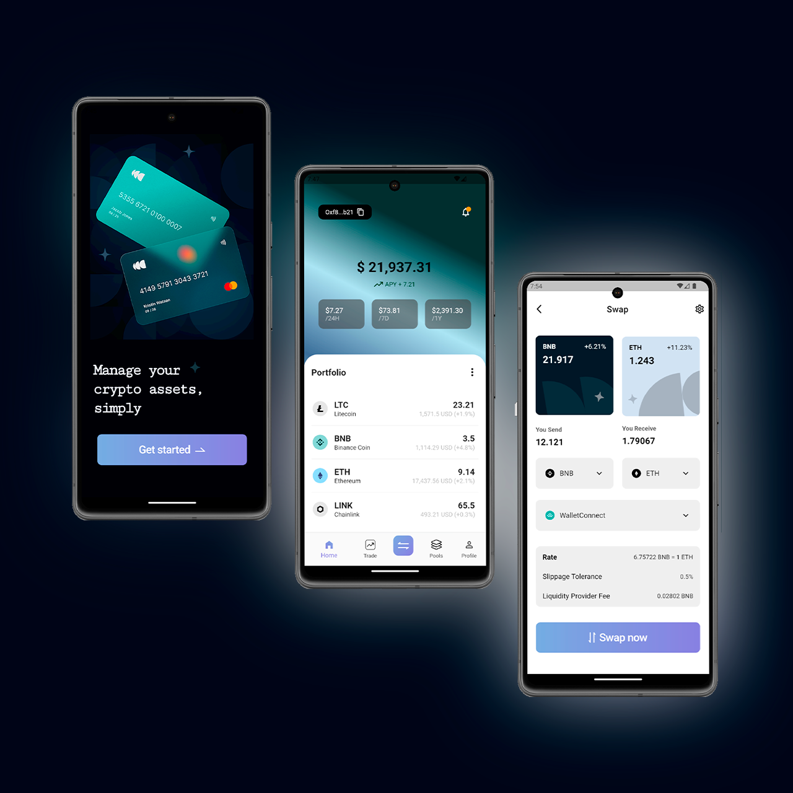

# 📱 Desafio Técnico - UI Mobile Crypto Wallet

Neste projeto, enfrentei o desafio proposto pelo professor, [@jsdaniell](https://github.com/jsdaniell), de recriar uma UI encontrada no Dribbble, usando Flutter, um SDK do qual nunca tive experiência anterior. A experiência foi especialmente desafiadora, dada minha falta de familiaridade prévia com a linguagem. No entanto, ao longo do desenvolvimento, pude perceber o poder e versatilidade do Flutter como ferramenta de desenvolvimento, me surpreendendo positivamente com suas capacidades.

## 🗺️ Roteiro do Desafio

- **Desenvolvimento de UI a partir do Dribbble**:
  - Criação de uma interface mobile para crypto wallet.
  - Trabalho com três páginas principais: Get Started Page, Home Page e Swap Page.

## 🔧 Tecnologias Utilizadas

- **Flutter**: SDK open-source para criar aplicativos mobile nativos para iOS e Android a partir de um único código-fonte.
- **Dart**: Linguagem otimizada para desenvolvimento mobile, desktop e web.
- **Material Design (flutter/material.dart)**: Conjunto de widgets do Flutter que implementa as diretrizes de design material.
- **AutoSizeText (auto_size_text/auto_size_text.dart)**: Pacote que ajusta dinamicamente o tamanho do texto.
- **Navegação**: Uso da mecânica de `Navigator` e rotas do Flutter para a transição entre telas.
- **UI Customizado**: Implementação de design personalizado, gradientes e shaders.
- **Widgets Personalizados**: Uso extensivo de widgets como `ScaffoldMessenger`, `BottomNavigationBar`, `ListView`, `Stack`, entre outros.
- **Layout Adaptável**: Adaptação de UI usando `MediaQuery` de acordo com as dimensões do dispositivo.

## 🎞️ Apresentação Visual do Projeto
[Link para o vídeo aqui](URL_DO_VÍDEO)

## ⚙️ Como Executar o Projeto
1. Clone o repositório: `git clone [url-do-repositório]`.
2. Entre no diretório do projeto: `cd [nome-do-projeto]`.
3. Baixe as dependências: `flutter pub get`.
4. Inicie o app: `flutter run`.

## ✨  Agradecimentos
Agradeço ao professor José Daniel por propor este desafio e à LDC Serviços de Mídia Ltda por proporcionar essa oportunidade desafiadora, que certamente ampliou meus horizontes no mundo da programação.
